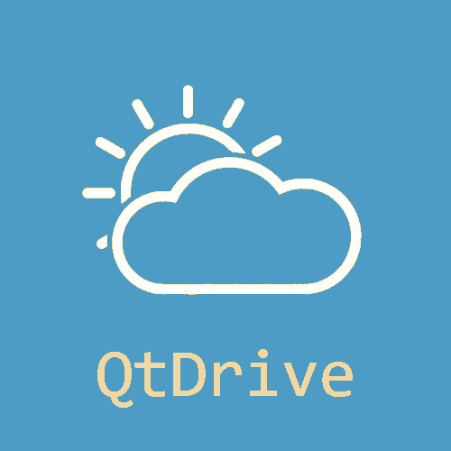

  

Progetto di **Programmazione ad Oggetti** dell'A.A **2020/2021**

Corso di **Laurea in Informatica** presso **Università degli Studi di Padova (UNIPD)**

Sviluppato da:
* **Alessandro Poloni** 1224444
* **Luca Polese** 1225425

### Premesse al progetto
Abbiamo sviluppato questo software per il corso di Programmazione ad Oggetti, poichè parte essenziale della valutazione dell'esame e delle competenze apprese dallo studente.

Lo scopo di sviluppare questo genere di progetti è quello di familiarizzare con il framework Qt, sia dal punto di vista di coding che da quello di gestione delle interfacce.

Il Prof. *Ranzato*, docente del corso, ha dato carta bianca relativamente alla tematica del progetto, imponendo però alcuni vincoli progettuali (varianti di anno in anno).

### Scopi del progetto
* Comprendere sul campo, come adottare il polimorfismo, perchè è necessario nel contesto della oop, 
* Realizzare una gerarchia di tipi, con numero di livelli \>= 2
* Sviluppare un contenitore con le sue funzioni. 

Il risultato dovrà perciò essere un applicativo che permetta di collegare i punti sopra citati: un software funzionante che permetta di interagire con la struttura dati e con la gerarchia permettendo di aggiungere, modificare, cancellare e ricercare i relativi oggetti.

### Obiettivi dell'applicazione
Con il recente avvento della rivoluzione 4.0, sempre più aziende hanno offerto, al pubblico e al privato, vari servizi tecnologici che hanno così permesso di diffondere rapidamente l’innovazione digitale.

Al giorno d’oggi, ciascuno di noi possiede almeno un account di un qualche servizio di cloud storage. Il problema maggiore che però possiamo riscontrare durante il suo uso quotidiano è proprio l’assenza di un modo per poter accedere alle informazioni in essi contenuti tutte in una volta sola.

L’idea alla base del nostro progetto, è stata quella di **simulare** e **semplificare l’accesso** contemporaneo a dei servizi di cloud storage, utilizzando un solo software.

Ogni account presenta caratteristiche comuni, ma differiscono principalmente nella quantità massima di spazio incluso nel servizio e dalle opportunità offerte singolarmente dalle aziende esistenti, che però *non dipendono strettamente da quanto abbiamo sviluppato*.

*Per maggiori dettagli implementativi si rimanda alla lettura delle relazioni:*
 - [Relazione Alessandro Poloni](relazionePoloni.pdf)
 - [Relazione Luca Polese](relazionePolese.pdf)

### Dettagli relativi allo sviluppo del progetto

| Voce | Dettagli |
| --- | --- |
| **Linguaggio di programmazione** 	 | `C++` | 
| **Tempo di sviluppo** 			 | 55+ ore |
| **Framework e librerie usate** 	 | STD, Qt |
| **Compatibilità verificate** 				 | Windows, Linux |
| **Versione di C++** 			 	 | C++11 |
| **Versione di Qt** 				 | 5.12.5, 5.9.5 |

### Valutazione finale del Prof.Ranzato

Il progetto è stato valutato come **Eccellente**, progetto **da lode**.

### Licenza ed informazioni per l'uso

Questo software è stato pubblicato con una licenza di tipo **GNU General Public License v3.0**. 
> Allo studente è severamente vietato riutilizzare questo progetto, che sia solo per qualche file o nella sua integrità, poichè andrebbe contro lo *spirito* del progetto, ma anche contro le regole dello stesso: ogni violazione verrà punita severamente con sanzioni molto pesanti.\
Il nostro progetto è stato pubblicato, così da permettere ai futuri studenti del corso di prendere ispirazione per la gestione delle informazioni e in modo da comprendere il meccanismo del MV di Qt.\
Chiunque verrà sorpreso a copiare da questo progetto, verrà **immediatamente** segnalato al Prof.Ranzato, perciò ogni richiesta di copiatura non verrà in alcun modo autorizzata.

**Buono Sviluppo Coders!**
